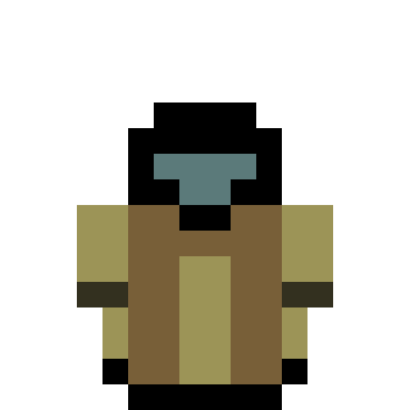

# Binary Factorium

> Do you love the *sweet smell of industry* in the morning?

> Does terra firma fill you with terror versus firm factory foundations?

> Have you ever looked at mother nature's plendour and thought, ***"Ugh..."***?

Well then, welcome aboard! You will be nobly shaving off that superfluous greenery, refining it into pure profit!

We have brave Fix-It pioneers, building up bargains factories, and now you too can join them!

> Welcome to the Awesome Shop.

# Serious Info Stuff (SIS)

This project is a Factorio-inspired game for the Fri3d Badge 2024 (and maybe 2026). It is currently in-development.

It'll be free for all to *use*, *learn*, and *install*, under the [licence](LICENCE) of this project.

## TESTER INFORMATION

You are testing out a stable snapshot of the development. Follow the [guide](SNAPSHOTTER.md)

## The Name

Binary Factorium uses the "shortname" `BinF` *(pronounced 'binf')* for almost all its writing. If this name were to be already in use, then know Binary Factorium is not trying to impersonate whatever uses it.

## Commit History

As you can see in the history of this repository, I mainly use Git as a save tool and as a way to sync my progress (however small) on other devices. Most of the code you see here is written in my free time, and not always on the same desktop/enviroment. Do *not* expect clean commit messages or diffs.

# Development & Maintenance

## Current Status

Currently the project is aiming for a **Minimal Viable Product** (*MVP*) meaning that it won't be the *complete* game. After [**Fri3d**](https://fri3d.be/) **2026** the game's development will continue, though it may be retargeted to desktop. If enough people like this project, it will become an actual game to play on [Steam](https://store.steampowered.com/about).

The current goal is to have a single, simple world with some basic factory logic.

Most of the Factory Logic has already been thought about on paper, but not yet implemented. (this is what we in science call [*procrastination*](https://en.wikipedia.org/wiki/Procrastination))

If you want to know the intended (& already planned) resource flow, look at [this overview](./webassets/Factorium.png). This was made with [drawio](https://www.drawio.com/).

> Yes, I love pasting in links °v°

## People

### StudA (me)

**Role**: *Main Developer & Designer*

### WHY_youLOokingAT_NaMe

**Role**: *Support* (vocal)

# Memory Overview

Mem/stor consumption overview (this will be later moved to docs)
Updates come and go, since I'm rushing to finish it.

## const (FLASH)

| component | memory |
| :-------- | :----: |
| colour palette | 512 bytes |
| tile sprites | 16.4 kb |
| key metadata | 16 bytes |

## runtime (SRAM)

Do to our `BinF::Engine Renderer` using double buffering, more than **half** our fast memory budget is spent (to comply with DMA capable RAM).

In short, **284 kilobytes** of our 512 kilobyte budget is used by literally just this system. 

Why not use a single buffer? Well, screen tear is a big problem. If you want to know why, just search up why people use double buffering.

### BinF::Engine (remaining)
| component | memory | info |
| :-------- | :----: | :--- |
| KeyTask | ~ 8.2 kb | The space allocated for the InputTask task/thread, which does debouncing on key presses async from game/engine logic |
| Key data | 204 bytes | Not counting for atomics, this is around the amount of memory the arrays take up |

### World & Chunk

| component | memory | info |
| :-------- | :----: | :--- |
| Local ChunkData | 2304 bytes | Soring local tiles in one big array (currently 3x3 chunks), not accounting for any nodes. |

**You have reached the bottem of the page**, please pay `500 MegaCredits` to continue.

